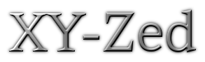

   
  

---

| buffer_font_family  | ui_font_family  |
|---|---|
| [Ligalex Mono](https://github.com/ToxicFrog/Ligaturizer)  | [BlexMono Nerd Font](https://www.nerdfonts.com/font-downloads)  |

## 🎯 Designed for Zed

Welcome to the XY-Zed theme for [Zed](https://zed.dev), a gorgeous dark theme designed with sensible syntax colors to enhance your coding experience.

XY-Zed is a meticulously crafted dark theme for Zed, aimed at improving readability and reducing eye strain during long coding sessions. The theme features sensible syntax colors, making it easier to write and review code. Please note that this theme is still in development and may not be perfect. We appreciate your feedback and contributions to make it better.

> [!Note]
> Unidentified elements are intentionally colored in bright red to make them easier to spot. If you encounter any such elements, please help us by reporting them on the GitHub repository along with a screenshot.

## 🚨 Reporting Issues

We welcome your feedback and issue reports. If you encounter any problems or have suggestions for improvement, please report them on our GitHub repository:

[XY-Zed Issues](https://github.com/zarifpour/xy-zed/issues)

Please include as much detail as possible, such as screenshots, text samples, and steps to reproduce the issue.

---

Made with 💚 by <a href="https://zarifpour.xyz">Daniel Zarifpour</a>

